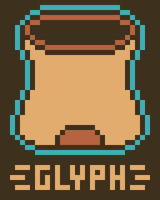

# Glyph

## Introduction

Glyph is a language that enables backend developers to approach programming with structured, organized, and intuitive code while introducing more powerful programming abilities. Glyph offers a functional paradigm with integrated imperative techniques, giving the programmer the power to complete complex tasks without losing their code's structure, and features a Rust-ic borrowing and ownership system to support memory manipulation. There will be some thematic words, but the majority of the language will be oriented towards simplicity and intuitivity to streamline the programming experience. Theming for Glyph comes from its root, Hieroglyph, the written symbols for the language of the Ancient Egyptians and other Ancient Civilizations.

## Features
TODO: Features

## Example Programs

# Hello World

| Glyph | JavaScript |
|-------|-----------|
| `affix io@exscribe`  `main = exscribe “Hello world!”` | `console.log(“Hello world!”)` |
| **Output** | **Output** |
| `Hello world!` | `Hello world!` |

---

# Defining and Calling Functions

| Glyph | JavaScript |
|-------|-----------|
| `affix io@exscribe`  `/@ numeric types can be partially genericized by dropping their size value@/` `evoke is_pythag_triple (a, b, c: uint) -> bool` `    = (a ** 2 + b ** 2 == c ** 2)`  `main = {` `    invoke exscribe is_pythag_triple (3, 4, 5)` `    invoke exscribe is_pythag_triple (3, 4, 6)` `}` | `const is_pythag_triple = (a, b, c) => (a ** 2 + b ** 2 == c ** 2);`  `console.log(is_pythag_triple(3, 4, 5));` `console.log(is_pythag_triple(3, 4, 6));` |
| **Output** | **Output** |
| `true` `false` | `true` `false` |

---

# Lambda Expressions

| Glyph | JavaScript |
|-------|-----------|
| `affix io@exscribe`  `/@ lambda expressions can be described using conjure @/` `multiply: (int32, int32) -> int64 = conjure {` `    a * b` `};`  `main = {` `    invoke exscribe multiply(4, 5);` `    invoke exscribe multiply(-2,-7);` `}` | `let multiply = (a, b) => {` `    return a * b;` `};`  `console.log(multiply(4, 5));` `console.log(multiply(-2, -7));` |
| **Output** | **Output** |
| `20` `14` | `20` `14` |

---

# Recursion

| Glyph | JavaScript |
|-------|-----------|
| `affix io@exscribe`  `/@ demonstrating recursion using the factorial function @/` `evoke factorial(n: uint) -> uint {` `    if (n == 0) {` `        return 1` `    }` `    n * factorial(n-1)` `}`  `main = {` `    result = factorial(5)` `    invoke exscribe result` `}` | `const factorial = (n) => {` `    if (n === 0) {` `        return 1;` `    }` `    return n * factorial(n-1);` `};`  `const result = factorial(5);` `console.log(result);` |
| **Output** | **Output** |
| `120` | `120` |

---

# String Operations

| Glyph | JavaScript |
|-------|-----------|
| `affix io@exscribe` `affix string@{Spacer, supplant}`  `/@ no type hints here, since we can infer it from the value! @/` `str1 = “Glyph”` `str2 = “Time!”`  `main = {` `    /@ automatically sets the infix for concatenation @/` `    /@ its value is local to this function and only this function @/` `    Spacer = ‘ ‘` `    result1 = str1 + str2` `    invoke exscribe result1`  `    result2 = str2 + str1` `    invoke exscribe result2`  `    result3 = supplant(result2, str, "")` `    invoke exscribe (result1 + result3)` `}` | `const str1 = "JavaScript";` `const str2 = "Time!";`  `let result1 = str1 + ‘ ‘ + str2;` `console.log(result1);`  `let result2 = str2 + ‘ ‘ + str1;` `console.log(result2);`  `let result3 = result2.replace(str2, "");` `console.log(result1 + ‘ ‘ + result3);` |
| **Output** | **Output** |
| `Glyph Time!` `Time! Glyph` `Glyph Time! Glyph` | `JavaScript Time!` `Time! JavaScript` `JavaScript Time! JavaScript` |

---

# Iteration

| Glyph | JavaScript |
|-------|-----------|
| `affix io@exscribe` `affix function@apply`  `my_array = ["Apple", "Banana", "Cherry", "Date", "Elderberry"]`  `/@ performs the first argument on each member of the second (currying type beat) @/` `main = apply exscribe my_array` | `const myArray = ["Apple", "Banana", "Cherry", "Date", "Elderberry"];`  `for (let i = 0; i < myArray.length; i++) {` `    console.log(myArray[i]);` `}` |
| **Output** | **Output** |
| `Apple` `Banana` `Cherry` `Date` `Elderberry` | `Apple` `Banana` `Cherry` `Date` `Elderberry` |
